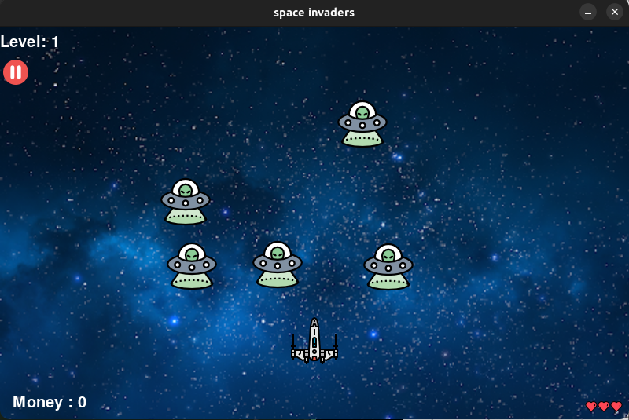

---

# Space Invaders Game



## Overview

Space Invaders is a classic arcade-style game where the player controls a spaceship that must defend Earth from invading aliens. The game features multiple levels with increasing difficulty, various types of enemy ships, and power-ups to aid the player.

This version of Space Invaders is implemented in Python using the Pygame library.

## Features

- **Player Controls**: Use the arrow keys or WASD keys to move the player's spaceship horizontally and vertically.
- **Shooting**: Press the spacebar key to shoot lasers at the invading aliens.
- **Alien Enemies**: Defend Earth from waves of alien invaders descending from the top of the screen. Be careful, as they move faster and become more aggressive with each level.
- **Power-ups**: power-ups such as bigger bullets or extra lives can be earned or used, providing temporary advantages to the player.
- **Scoring**: Earn points for each alien destroyed. Score extra points by defeating boss aliens or completing bonus objectives.

## Installation

1. Clone the repository:

   ```
   git clone https://github.com/yourusername/space-invaders.git
   ```

2. Install the required dependencies:

   ```
   pip install pygame
   ```

3. Run the game:

   ```
   python main.py
   ```

## Controls

- **Movement**: Use the arrow keys (or WASD keys) to move the spaceship.
- **Shoot**: Press the spacebar key to shoot bullets.

## Gameplay

- **Objective**: Destroy all the alien invaders and the asteroids while avoiding their attacks. The game ends if the player's looses all the lives.
- **Levels**: Progress through multiple levels, each with increasing difficulty and new challenges.

## Credits

- **Developer**: [Siddharth Maurya (DarthSidM)](https://github.com/DarthSidM)

## License

This project is licensed under the [MIT License](LICENSE).

## Acknowledgements

Special thanks to [Pygame](https://www.pygame.org/) for providing a powerful and easy-to-use library for game development in Python.

---

